  

<table>
  <tr>
    <td valign="top" align="center"></td>
    <td valign="top" align="center"></td>
  </tr>
</table>

<!-- HERO SECTION -->

  <h3><strong>SDET | AI-Driven Test Automation &amp; Performance Engineering</strong></h3>
  
<i>SDET turning manual chaos into automated, AI-driven quality.</i>

  

    
    
    
    
  

  
   
  

 

<!-- ABOUT ME -->
<h2 align="center">🚀 About Me</h2>

- 🎓 **MS in Cybersecurity** — University at Buffalo
- 💼 **SDET @ GlobalLogic** — automated testing for a large-scale pharmacy supply chain platform
- 🤖 **AI-driven engineering** — LLM test-case generation, agentic failure triage, RAG assistants (Azure OpenAI + AI Foundry)
- ⚡ **Performance engineering** — JMeter load scenarios, p90/p95/p99 SLA analysis under peak load
- 🌱 Currently exploring **LLM evals, AI agents, and RAG systems**

> <i>"I find the repetitive manual work — and automate it away."</i>

 

<!-- TECH STACK -->

  

  
   
  
   
  
   
  

  
  
  

 

<!-- AI ENGINEERING -->

  

- **AI Test Case & Gherkin Generator** — LLM-backed test generation from requirements via Azure OpenAI + AI Foundry REST APIs; auto-generates Gherkin scenarios for the supply chain platform.
- **AI-Powered Failure Analysis & Agentic Triage** — tool-calling agents with prompt orchestration that correlate failures across Service Bus, Cosmos DB, and Talend, file structured defect reports, and cut manual triage time.
- **RAG Knowledge Assistant** — retrieval-based LLM assistant grounded in enterprise context for accurate, cited responses.
- **Shift-left initiative** — brought the manual-analysis bottleneck to the engineering team and drove AI automation of failure and performance analysis.

 

<!-- FEATURED PROJECTS -->
<h2>💼 Featured Projects</h2>

| Project | Stack |
|---|---|
| **AI Test Case & Gherkin Generator** — LLM-backed test generation from requirements | Azure OpenAI, AI Foundry, Java, Cucumber |
| **AI-Powered Failure Analysis & Agentic Triage** — autonomous triage of pipeline failures | Azure OpenAI, Python, JMeter, Azure DevOps |
| **Performance Test Automation Toolkit** — end-to-end load-testing toolkit with SLA reporting | Python, JMeter, SQL, Azure Service Bus |
| **Home-Lab SOC Pipeline** — containerized detection stack with MITRE ATT&CK-mapped rules | Wazuh, ELK, Suricata, Docker, Kali |
| **Web App Security Testing Toolkit** — multi-scanner wrapper with normalized reporting | Python, BurpSuite, OWASP ZAP, SQLMap |

 

<!-- EXPERIENCE -->
<h2>🚀 Experience</h2>

- **SDET — GlobalLogic Inc.** (Jun 2025 – Sep 2026) · Test automation, performance engineering & AI-driven quality for a pharmacy supply chain platform
- **Software Engineer (Part-time) — WeServe Technologies** (May 2025 – Jun 2025) · .NET tooling, network security, AI-assisted anomaly detection
- **Cybersecurity & Pen Testing Intern — Flow Global Technologies** (May 2024 – Dec 2024) · SIEM, incident response, SOC2
- **Software Engineer — Tech Mahindra** (Feb 2022 – Jul 2023) · Java/Spring Boot, IBM Maximo, REST APIs
- **Systems Executive Trainee — Miramed Ajuba** (Oct 2021 – Jan 2022) · Automation, Graylog SIEM

 

<!-- GITHUB ANALYTICS -->
<h2 align="center">📈 GitHub Analytics</h2>

  

  

  
  

  

