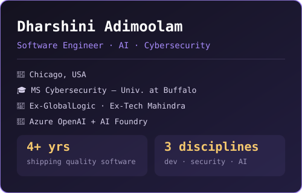
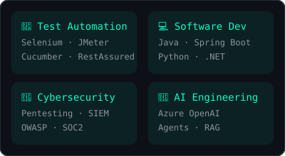

<table>
  <tr>
    <td valign="top" align="center"></td>
    <td valign="top" align="center"></td>
  </tr>
</table>

<!-- HERO SECTION -->

  <h3><strong>SDET | Software Engineer | Cybersecurity</strong></h3>
  
<i>I build software, break it safely, secure it — and automate the whole loop.</i>

  

    
    
    
    
  

  

 

<!-- ABOUT & MEDIA SECTION -->
<!-- ================= ABOUT ME ================= -->
<h2 align="center">🚀 About Me</h2>

<table width="100%" border="0">
<tr>
<td width="40%" valign="top" style="border: none; background: none;">

### 🧑‍💻 Who am I?

* 🧪 **SDET @ GlobalLogic** — test automation for a large-scale pharmacy supply chain platform
* 💻 **Software Engineer** — Java/Spring Boot, IBM Maximo, .NET (ex-Tech Mahindra, WeServe)
* 🔐 **Cybersecurity** — penetration testing, Wazuh SIEM, MITRE ATT&CK, SOC2 (MS, Univ. at Buffalo)
* 🤖 **AI engineering** — LLM test generation, agentic failure triage, RAG assistants (Azure OpenAI + AI Foundry)
* ⚡ **Performance engineering** — JMeter, p90/p95/p99 SLA analysis under peak load

<blockquote>
  

    <i>"I find the repetitive manual work — and automate it away."</i>
  

</blockquote>

</td>

<td width="60%" align="center" valign="middle" style="border: none; background: none;">

</td>
</tr>
</table>

---

<!-- ================= ENGINEERING FOCUS ================= -->
<!-- Section Header with subtle typing or glow effect layout -->
<!-- Section Header with a matching Dark/Glow theme -->

  

<!-- Animated Metrics Section -->

  
  
  
  

<!-- Left/Right Split: Perfectly balanced with working assets -->
<table align="center" width="100%" border="0">
  <tr>
    <td align="center" width="50%" style="border: none; background: none;">
      
    </td>
    <td align="center" width="50%" style="border: none; background: none;">
      <!-- Using a GitHub-native typing animation that never fails to render -->
      
    </td>
  </tr>
</table>

<!-- Animated Footer Divider -->

  

---

### 🏅 Achievements

- 🥇 **Blue Team Lead** — UB Internal Lockdown 2023 & 2024
- 🛡️ **15+ critical incidents** resolved, triaged against MITRE ATT&CK
- 📜 **SOC2 audit readiness** improved by 75%
- 🎓 **MS Cybersecurity**, University at Buffalo — GPA 3.67/4.0
- 📜 Certifications: **AWS Cloud Practitioner** · **Google Cybersecurity Professional**
<!-- SKILLS SHOWCASE -->
<h2>⚡ Tech Stack & Engineering Arsenal</h2>

<table width="100%" align="center">
  <tr>
    <td width="50%" valign="top">
      <h3>💻 Languages</h3>
      
        
      <h3>🧪 Test Automation</h3>
      
        
      <h3>⚙️ Backend & APIs</h3>
      
        
      <h3>🗄️ Databases</h3>
      
        
      <h3>☁️ Cloud & DevOps</h3>
      
    </td>
    <td width="50%" valign="top">
      <h3>🤖 Artificial Intelligence</h3>
      

        
        
         LLM Integration • Prompt Orchestration • Agentic Workflows • RAG • AI Test Generation • Failure Triage Agents
      

       
      <h3>🔐 Security & Compliance</h3>
      
OWASP Top 10 • JWT / OAuth2 / RBAC • Wazuh SIEM • MITRE ATT&CK • HIPAA • SOC2 • BurpSuite • Penetration Testing

       
      <h3>📊 Data Engineering</h3>
      
Azure Data Factory • Talend • ETL Pipelines • SQL Reconciliation • Cosmos DB • Data Quality Checks

       
      <h3>👀 Monitoring & Observability</h3>
      
ELK Stack • Grafana • Wazuh • Graylog • Suricata • p90/p95/p99 SLA Reporting

    </td>
  </tr>
</table>

<!-- PROJECTS -->
<h2>💼 Featured Projects</h2>

<table width="100%">
  <tr>
    <td width="50%" valign="top">
      <h3>🤖 <a href="https://dharshuadhi.github.io/dharshini-portfolio/">AI Test Case & Gherkin Generator</a></h3>
      
LLM-backed test generation from requirements via Azure OpenAI + AI Foundry; auto-generates Gherkin scenarios.

      

        <code>Azure OpenAI</code> <code>AI Foundry</code> <code>Java</code> <code>Cucumber</code>
      

      <ul>
        <li>✔ Requirement → test case automation</li>
        <li>✔ Readable, traceable Gherkin output</li>
      </ul>
    </td>
    <td width="50%" valign="top">
      <h3>🔍 <a href="https://dharshuadhi.github.io/dharshini-portfolio/">AI Failure Analysis & Agentic Triage</a></h3>
      
Tool-calling agents correlate failures across Service Bus, Cosmos DB & Talend and file defect reports.

      

        <code>Azure OpenAI</code> <code>Python</code> <code>JMeter</code> <code>Azure DevOps</code>
      

      <ul>
        <li>✔ Autonomous pipeline triage</li>
        <li>✔ Structured defect reports</li>
      </ul>
    </td>
  </tr>
  <tr>
    <td width="50%" valign="top">
      <h3>⚡ <a href="https://dharshuadhi.github.io/dharshini-portfolio/">Performance Test Automation Toolkit</a></h3>
      
End-to-end load-testing toolkit: data prep, high-volume ingestion, p90/p95/p99 SLA reports.

      

        <code>Python</code> <code>JMeter</code> <code>SQL</code> <code>Azure Service Bus</code>
      

      <ul>
        <li>✔ Config-driven, reusable modules</li>
        <li>✔ Run-over-run SLA comparison</li>
      </ul>
    </td>
    <td width="50%" valign="top">
      <h3>🛡️ <a href="https://dharshuadhi.github.io/dharshini-portfolio/">Home-Lab SOC Pipeline</a></h3>
      
Containerized detection stack with MITRE ATT&CK-mapped rules and red-team validation.

      

        <code>Wazuh</code> <code>ELK</code> <code>Suricata</code> <code>Docker</code> <code>Kali</code>
      

      <ul>
        <li>✔ Custom detection rules</li>
        <li>✔ Kibana dashboards for MTTD</li>
      </ul>
    </td>
  </tr>
  <tr>
    <td width="50%" valign="top">
      <h3>🔎 <a href="https://dharshuadhi.github.io/dharshini-portfolio/">Web App Security Testing Toolkit</a></h3>
      
Multi-scanner wrapper normalizing BurpSuite, ZAP & SQLMap output into one structured report.

      

        <code>Python</code> <code>BurpSuite</code> <code>OWASP ZAP</code> <code>SQLMap</code>
      

      <ul>
        <li>✔ Severity + CWE + remediation notes</li>
        <li>✔ Cuts manual triage time</li>
      </ul>
    </td>
  </tr>
</table>

<!-- ENGINEERING EXPERIENCE -->
<h2>🚀 Engineering Experience</h2>

From enterprise software to cybersecurity to AI-driven quality — I build, break, and secure production systems.

<table width="100%">
  <tr>
    <td width="33%" valign="top">
      <h3>🧪 Test Automation</h3>
      <ul>
        <li>Selenium & Appium</li>
        <li>Cucumber BDD / Gherkin</li>
        <li>RestAssured API suites</li>
        <li>Contract testing</li>
        <li>CI/CD-gated runs</li>
      </ul>
    </td>
    <td width="33%" valign="top">
      <h3>💻 Software Development</h3>
      <ul>
        <li>Java / Spring Boot</li>
        <li>IBM Maximo customizations</li>
        <li>.NET / C# tooling</li>
        <li>REST APIs & microservices</li>
        <li>Unit & integration tests</li>
      </ul>
    </td>
    <td width="34%" valign="top">
      <h3>🔐 Cybersecurity</h3>
      <ul>
        <li>Penetration testing</li>
        <li>Wazuh SIEM & MITRE ATT&CK</li>
        <li>OWASP Top 10</li>
        <li>JWT / OAuth2 / RBAC</li>
        <li>HIPAA & SOC2</li>
      </ul>
    </td>
  </tr>
  <tr>
    <td width="33%" valign="top">
      <h3>🤖 AI Engineering</h3>
      <ul>
        <li>Azure OpenAI & AI Foundry</li>
        <li>Prompt orchestration</li>
        <li>Tool-calling agents</li>
        <li>RAG assistants</li>
        <li>LLM failure analysis</li>
      </ul>
    </td>
    <td width="33%" valign="top">
      <h3>⚡ Performance</h3>
      <ul>
        <li>JMeter load scenarios</li>
        <li>p90/p95/p99 SLA analysis</li>
        <li>Soak / spike / stress</li>
        <li>Throughput profiling</li>
      </ul>
    </td>
    <td width="34%" valign="top">
      <h3>📊 Data & DevOps</h3>
      <ul>
        <li>Azure Service Bus & ADF</li>
        <li>Cosmos DB & SQL</li>
        <li>Talend ETL</li>
        <li>Docker & Azure DevOps</li>
        <li>ELK & Grafana monitoring</li>
      </ul>
    </td>
  </tr>
</table>

<!-- HIGHLIGHTS -->
<h2>🏆 Career Highlights</h2>

From enterprise software to cybersecurity to AI-driven quality engineering, I have shipped <strong>5+ engineering projects</strong> across test automation, software development, security, and AI.

  <strong>🚀 Technologies & Domains Worked On:</strong> 
  Selenium Automation • JMeter Performance Engineering • Java / Spring Boot • .NET / C# • IBM Maximo • Penetration Testing • Wazuh SIEM • MITRE ATT&CK • OWASP • AI Test Generation • Agentic Triage • RAG Systems • Azure Service Bus • Cosmos DB • ADF & Talend ETL • HIPAA & SOC2 • Docker • Azure DevOps CI/CD

<!-- GITHUB STATS -->
<h2>📈 GitHub Analytics</h2>

  
  

  

    
  

